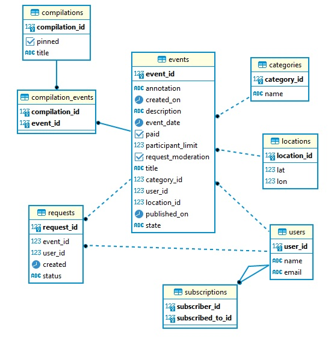

# Приложение ExploreWithMe

Стек: Java, Maven, Spring Boot, Postgres, Hibernate, Docker

Приложение — афиша. В этой афише можно предложить какое-либо событие от выставки до похода в кино
и собрать компанию для участия в нём.

Приложение разделено на два сервиса:

- основной сервис содержать всё необходимое для работы продукта;
- сервис статистики хранит количество просмотров и позволяет делать различные выборки для анализа работы приложения.

Спецификация основного сервера:
https://app.swaggerhub.com/apis/ARTURINZHILOV/explore-with_me_main_server/1.0

Спецификация сервера статистики:
https://app.swaggerhub.com/apis/ARTURINZHILOV/stat-service_api/v0

Схема базы данных основного сервиса:

